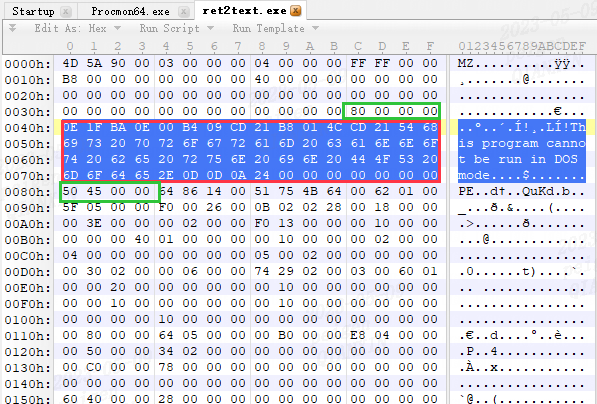

[toc]

# PE

## 可执行文件结构

Windows :PE 
Linux:ELF

同源COFF格式

PE文件特征


## 基本概念
PE文件总体结构如下图


主要4个部分
1. DOS头
2. PE头
3. 区块表（节表）
4. 区块表（节表）数据

通常把PE文件分成两层
1. DOS头、PE头和节表属于PE文件的数据管理结构或数据组织结构部分
2. 节表数据才是PE文件真正的数据部分，其中包含着代码、数据、资源等内容

pe文件在硬盘中的样子

pe文件在内存中的样子


### 文件偏移地址
某个数据的位置相对于文件头的偏移量称为文件偏移地址或物理地址。文件偏移地址从PE文件的第一个字节开始计数

## MS-DOS头部
为什么PE结构的最开始位置有这样一段DOS头部呢？关键是为了该可执行程序可以兼容DOS系统。

由于其开始处的两个字节为“MZ”，因此DOS头也可以叫作MZ头。该部分用于程序在DOS系统下加载，它的结构被定义为IMAGE_DOS_HEADER

结构被定义为IMAGE_DOS_HEADER


``` c
typedef struct _IMAE_DOS_HEADER {       //DOS .EXE header位置  
    WORD e_magic;                       //Magic number;     0x00  
    WORD e_cblp;                        //Bytes on last page of file                         0x02  
    WORD e_cp;                          //Pages in file     0x04  
    WORD e_crlc;                        //Relocations       0x06  
    WORD e_cparhdr;                     //Size of header in paragraphs                       0x08  
    WORD e_minalloc;                    //Minimum extra paragraphs needed                    0x0A  
    WORD e_maxalloc;                    //Maximum extra paragraphs needed                    0x0C  
    WORD e_ss;                          //Initial (relative) SS value                        0x0E  
    WORD e_sp;                          //Initial SP value  0x10  
    WORD e_csum;                        //Checksum          0x12  
    WORD e_ip;                          //Initial IP value  0x14  
    WORD e_cs;                          //Initial (relative) CS value                        0x16  
    WORD e_lfarlc;                      //File address of relocation table                   0x18  
    WORD e_ovno;                        //Overlay number    0x1A  
    WORD e_res[4];                      //Reserved words    0x1C  
    WORD e_oemid;                       //OEM identifier (for e_oeminfo)                     0x24  
    WORD e_oeminfo;                     //OEM information; e_oemid specific                  0x26   
    WORD e_res2[10];                    //Reserved words    0x28  
    LONG e_lfanew;                      //File address of new exe header                     0x3C  
} IMAGE_DOS-HEADER, *PIMAGE_DOS_HEADER;  
```



红圈部分修改不影响程序运行 
在免杀技术、PE文件大小优化等技术中会对该部分进行处理

## PE文件头
PE头部保存着Windows系统加载可执行文件的重要信息


PE头部由**IMAGE_NT_HEADERS**定义。从该结构体的定义名称可以看出，IMAGE_NT_HEADERS由多个结构体组合而成，包括
1. IMAGE_NT_SIGNATRUE
2. IMAGE_FILE_HEADER和
3. IMAGE_OPTIO NAL_HEADER三部分


``` c
typedef struct _IMAGE_NT_HEADERS {
  DWORD                   Signature;
  IMAGE_FILE_HEADER       FileHeader;
  IMAGE_OPTIONAL_HEADER32 OptionalHeader;
} IMAGE_NT_HEADERS32, *PIMAGE_NT_HEADERS32;
```


### Signature字段
将文件标识为 PE 映像的 4 字节签名。 字节为“PE\0\0”。

### IMAGE_FILE_HEADER结构
``` c
typedef struct _IMAGE_FILE_HEADER {
  WORD  Machine;
  WORD  NumberOfSections;
  DWORD TimeDateStamp;
  DWORD PointerToSymbolTable;
  DWORD NumberOfSymbols;
  WORD  SizeOfOptionalHeader;
  WORD  Characteristics;
} IMAGE_FILE_HEADER, *PIMAGE_FILE_HEADER;
# define IMAGE_SIZEOF_FILE_HEADER 20字节
```


**Machine**(2字节)
|Value | 含义|
|--|--|
|IMAGE_FILE_MACHINE_I386 | 0x014c  Intel x86|
|IMAGE_FILE_MACHINE_ALPHA | 0x0184  DEC Alpha|
|IMAGE_FILE_MACHINE_IA64 | 0x0200  Intel Itanium|
|IMAGE_FILE_MACHINE_AMD64 | 0x8664  DEC AlphaX64|

截图中为 DEC AlphaX64

**NumberOfSections**(2字节):

节数。 这指示部分表的大小，该表紧跟在标头之后。Windows 加载程序将分区数限制为 96。
截图中节区 0x0014   20个

**TimeDateStamp**:
链接器创建映像的日期和时间

**NumberOfSymbols**: 如果有COFF 符号表，它代表其中的符号数目，COFF符号是一个大小固定的结构，如果想找到COFF 符号表的结束位置，则需要这个变量。

**SizeOfOptionalHeader**: 紧跟着IMAGE_FILE_HEADER 后边的数据结构（IMAGE_OPTIONAL_HEADER）的大小。(对于32位PE文件，这个值通常是00E0h；对于64位PE32+文件，这个值是00F0h )。

**Characteristics**: 文件属性，有选择的通过几个值可以运算得到。( 这些标志的有效值是定义于 winnt.h 内的 IMAGE_FILE_** 的值，具体含义见下表。
普通的EXE文件这个字段的值一般是 0100h，DLL文件这个字段的值一般是 210Eh。)小甲鱼温馨提示：多种属性可以通过 “或运算” 使得同时拥有！

|Value |-| 含义|
|--|--|--|
|IMAGE_FILE_RELOCS_STRIPPED | 0x0001|  重新定位信息已从文件中删除。 文件必须加载在其首选基址上。 如果基址不可用，则加载程序报告错误|
|IMAGE_FILE_EXECUTABLE_IMAGE | 0x0002|  文件是可执行文件， (没有未解析的外部引用) |
|IMAGE_FILE_LINE_NUMS_STRIPPED | 0x0004|  COFF 行号已从文件中剥离|
|IMAGE_FILE_LOCAL_SYMS_STRIPPED | 0x0008|  COFF 符号表条目已从文件中剥离|
|IMAGE_FILE_AGGRESIVE_WS_TRIM | 0x0010|  积极剪裁工作集。 该值已过时|
|IMAGE_FILE_LARGE_ADDRESS_AWARE | 0x0020|  应用程序可以处理大于 2 GB 的地址|
|IMAGE_FILE_BYTES_REVERSED_LO | 0x0080|  反转单词的字节数。 此标志已过时|
|IMAGE_FILE_32BIT_MACHINE | 0x0100|  计算机支持 32 位单词|
|IMAGE_FILE_DEBUG_STRIPPED | 0x0200|  调试信息已被删除并单独存储在另一个文件中|
|IMAGE_FILE_REMOVABLE_RUN_FROM_SWAP | 0x0400| 如果映像位于可移动媒体上，请将其复制到交换文件并从中运行|
|IMAGE_FILE_NET_RUN_FROM_SWAP | 0x0800|  如果映像位于网络上，请将其复制到交换文件中并从中运行|
|IMAGE_FILE_SYSTEM | 0x1000|  映像是系统文件|
|IMAGE_FILE_DLL | 0x2000|  映像是 DLL 文件。 虽然它是可执行文件，但它不能直接运行|
|IMAGE_FILE_UP_SYSTEM_ONLY | 0x4000|  该文件应仅在单处理器计算机上运行|
|IMAGE_FILE_BYTES_REVERSED_HI | 0x8000|  反转单词的字节数。 此标志已过时|

### IMAGE_OPTIONAL HEADER结构

``` c
typedef struct _IMAGE_OPTIONAL_HEADER {
  WORD                 Magic; //表明是ROM映像还是普通的可执行映像 0x18
  BYTE                 MajorLinkerVersion;//链接器主版本号0x1A
  BYTE                 MinorLinkerVersion;//链接器次版本号0X1B
  DWORD                SizeOfCode;//所有含有代码的区块的大小0X1C
  DWORD                SizeOfInitializedData;//初始化数据区块的大小
  DWORD                SizeOfUninitializedData;//未初始化数据区块的大小
  DWORD                AddressOfEntryPoint;//执行入口RVA
  DWORD                BaseOfCode;//代码区块起始地址
  DWORD                BaseOfData;//数据段的起始地址
  DWORD                ImageBase;//程序默认载入基地址
  DWORD                SectionAlignment;//内存中区块的对齐值
  DWORD                FileAlignment;//文件中区块的对齐值
  WORD                 MajorOperatingSystemVersion;//要求操作系统主版本号
  WORD                 MinorOperatingSystemVersion;//要求操作系统次版本号
  WORD                 MajorImageVersion;//PE文件本身主版本号
  WORD                 MinorImageVersion;//PE文件本身次版本号
  WORD                 MajorSubsystemVersion;//要求的子系统最低的主版本号
  WORD                 MinorSubsystemVersion;//要求的子系统最低的次版本号
  DWORD                Win32VersionValue; //保留字段，通常为0
  DWORD                SizeOfImage;//PE文件被装载到内存空间后总的大小，指从ImageBase到最后一个区块的大小
  DWORD                SizeOfHeaders;//Dos头、DosStub、PE头以及区块头的总大小，并进行FileAlignment对齐后的大小
  DWORD                CheckSum;//校验和，一般的EXE文件通常为0，对重要的系统驱动程序而言比较有意义
  WORD                 Subsystem;//子系统，EXE最常用的子系统类型有console以及windows，分别对应控制台应用程序以及GUI应用程序
  WORD                 DllCharacteristics;//包含有DEP以及ASLR相关的属性位
  DWORD                SizeOfStackReserve;//初始化时栈大小
  DWORD                SizeOfStackCommit;//初始化时实际提交栈大小
  DWORD                SizeOfHeapReserve;//初始化时保留堆的大小
  DWORD                SizeOfHeapCommit;//初始化时实际保留堆的大小
  DWORD                LoaderFlags;//调试相关默认0
  DWORD                NumberOfRvaAndSizes;//数据目录项的个数，固定为16，即后面一个成员DataDirectory的数组元素个数
  IMAGE_DATA_DIRECTORY DataDirectory[IMAGE_NUMBEROF_DIRECTORY_ENTRIES];//数据目录表，包含有输入表、输出表等表项的具体信息
} IMAGE_OPTIONAL_HEADER32, *PIMAGE_OPTIONAL_HEADER32;
```


### 基地址
PE文件通过windows加载器载入内存后，初始内存地址称为基地址。内存中的程序称为模块，映射文件的起始地址称为模块句柄。通过模块句柄访问内存中的其他数据结构。
### 虚拟地址
PE文件被系统加载器映射到内存中。每个程序都有自己的虚拟空间，虚拟空间的内存地址称为虚拟地址。

### 相对虚拟地址
虚拟地址(VA) = 基地址（ImageBase） + 相对虚拟地址（RVA）

IMAGE_DATA_DIRECTORY DataDirectory[IMAGE_NUMBEROF_DIRECTORY_ENTRIES];
这个字段是最重要的字段之一，它由16个相同的IMAGE_DATA_DIRECTORY结构组成，虽然PE文件中的数据是按照装入内存后的页属性归类而被放在不同的节中的，但是这些处于各个节中的数据按照用途可以被分为导出表、导入表、资源、重定位表等数据块，这16个IMAGE_DATA_DIRECTORY结构就是用来定义多种不同用途的数据块的IMAGE_DATA_DIRECTORY结构的定义很简单，它仅仅指出了某种数据块的位置和长度。


## 输入表


可执行文件使用其他DLL的代码或数据的动作称为输入，PE文件被载入时，windows加载器工作之一是定位所有被输入的函数和数据 让正在载入的文件可以使用那些地址  通过导入表完成的 Import Table，输入表就相当于 EXE文件与 DLL文件沟通的钥匙


在PE文件映射到内存后，windows将相应的DLL文件装入，EXE文件通过“输入表”找到相应的DLL中的导入函数


### 输入表的结构
IMAGE_IMPORT_DESCRIPTOR(简称IID)


``` c
typedef struct _IMAGE_IMPORT_DESCRIPTOR {  
    _ANONYMOUS_UNION union {              //00h  
        DWORD Characteristics;  
        DWORD OriginalFirstThunk;   
    } DUMMYUNIONNAME;  
    DWORD TimeDateStamp;                  //04h  
    DWORD ForwarderChain;                 //08h  
    DWORD Name;                           //0Ch  
    DWORD FirstThunk;                     //10h 
```


在IMAGE_OPTIONAL_HEADER 中的 DataDirectory[16] 数组保存了 输入表的RVA跟大小。通过RVA可以在OD中加载程序通过 ImageBase+RVA 找到 输入表，或者通过RVA计算出文件偏移地址，查看磁盘中的可执行文件，通过文件偏移地址找到输入表。


OriginalFirstThunk
指向一个IMAGE_THUNK_DATA数组叫做**输入名称表Import Name Table（INT）**，用来保存函数，。
```

typedef struct _IMAGE_THUNK_DATA32 {  
    union {  
        DWORD ForwarderString;  
        DWORD Function;  
        DWORD Ordinal;  
        DWORD AddressOfData;  
    } u1;  
} IMAGE_THUNK_DATA32,*PIMAGE_THUNK_DATA32;
```

当IMAGE_THUNK_DATA 的值最高位为1时，表示函数是以序号方式输入，这时低31为被当作函数序号。当最高位是0时，表示函数是以字符串类型的函数名方式输入的，这时，IMAGE_THUNK_DATA 的值为指向IMAGE_IMPORT_BY_NAME 的结构的RVA。

```
typedef struct _IMAGE_IMPORT_BY_NAME {  
    WORD Hint;  
    BYTE Name[1];  
} IMAGE_IMPORT_BY_NAME,*PIMAGE_IMPORT_BY_NAME;
```

**Hint** 表示这个函数在其所驻留dll的输出表的序号，不是必须的。
**Name** 表示 函数名，是一个ASCII字符串以0结尾，大小不固定。


Name
它表示DLL 名称的相对虚地址（译注：相对一个用null作为结束符的ASCII字符串的一个RVA，该字符串是该导入DLL文件的名称。如：KERNEL32.DLL）。

FirstThunk
指向IMAGE_THUNK_DATA数组叫做**输入地址表Import Address Table（IAT）**

在Orignal First Thunk缺席下，它指向first thunk：Hints和The Function names的thunks。


INT保存的是这个程序导入这个dll中函数信息，它是固定的不会被修改。但是IAT会在程序加载时被重写，当程序加载时，它会被PE加载器重写成 这些函数的在内存中的真正地址。即把它原来指向的IMAGE_IMPORT_BY_NAME 改成 函数真正的地址。


静态修改PE文件法：
1.备份原IID结构
2.在原IID区域构造新的OriginalFirstThunk、Name和FirstThunk结构
3.填充新输入表项的IID结构
4.修正PE文件头的信息

进程创建期修改PE输入表法：
1.以挂起方式创建目标进程
2.获取目标进程中的PE结构信息
3.获取原IID大小，增加一项，搜索可用的节空隙
4.构造心的IID及其相关的OriginalFirstThunk、Name和FirstThunk结构
5.修正PE映像头
6.更新目标进程的内存。
7.继续运行主线程


导入表注入

https://bbs.kanxue.com/thread-262420.htm


1. 将要注入dll的程序写入到内存中，并新增一个节
2. 拷贝原来的导入表到新节中
3. 在新节拷贝的导入表后新增一个导入表_IMAGE_IMPORT_DESCRIPTOR
4. 增加8字节的INT表和8字节的IAT表
5. 存储要注入的dll的名称
6. 增加一个_IMAGE_IMPORT_BY_NAME结构，并将函数名称存进结构体第一个变量后的内存中
7. 将_IMAGE_IMPORT_BY_NAME结构的地址的RVA赋值给INT表和IAT表第一项
8. 将dll名称所在位置的首地址的RVA赋值给新增导入表的Name
9. 修改IMAGE_DATA_DIRECTORY结构的VirtualAddress和Size


### 输入函数的调用
## 区块
### 区块表(节表)
程序的组织按照各属性的不同而被保存在不同的节中

描述节表的结构体是IMAGE_SECTION_HEADER，如果PE文件中有N个节，那么节表就是由N个IMAGE_SECTION_HEADER组成的数组


节表中存储了各个节的属性、文件位置、内存位置等相关的信息
``` c
typedef struct _IMAGE_SECTION_HEADER {
    BYTE    Name[IMAGE_SIZEOF_SHORT_NAME];//8个字节
    union {
            DWORD   PhysicalAddress;
            DWORD   VirtualSize;
    } Misc;
    DWORD   VirtualAddress;
    DWORD   SizeOfRawData;
    DWORD   PointerToRawData;
    DWORD   PointerToRelocations;
    DWORD   PointerToLinenumbers;
    WORD    NumberOfRelocations;
    WORD    NumberOfLinenumbers;
    DWORD   Characteristics;
} IMAGE_SECTION_HEADER, *PIMAGE_SECTION_HEADER;
```

**Name**：这是一个8位的ASCII(不是Unicode内码)，用来定义块名，多数块名以，开始(如.Text)，这个实际上不是必需的，注意如果块名超过了8个字节，则没有最后面的终止标志NULL字节，带有$的区块的名字会从编译器里将带有$的相同名字的区块被按字母顺序合并。
**VirtualSize**：指出实际的，被使用的区块大小，是区块在没有对齐处理前的实际大小.如果VirtualSize > SizeOfRawData,那么SizeOfRawData是可执行文件初始化数据的大小(SizeOfRawData – VirtualSize)的字节用0来填充。这个字段在OBJ文件中被设为0。
**VirtualAddress**：该块时装载到内存中的RVA，注意这个地址是按内存页对齐的，她总是SectionAlignment的整数倍，在工具中第一个块默认RVA为1000，在OBJ中为0。
**SizeofRawData**：该块在磁盘中所占的大小,在可执行文件中，该字段包括经过FileAlignment调整后块的长度。例如FileAlignment的大小为200h，如果VirtualSize中的块长度为19Ah个字节，这一块保存的长度为200h个字节。
//在内存中展开该节的时，VirtualSize 和 SizeofRawData 哪个值比较大，按照哪个值展开。

**PointerToRawData**：该块是在磁盘文件中的偏移，程序编译或汇编后生成原始数据，这个字段用于给出原始数据块在文件的偏移，即在文件中展开该节时的起始地址，如果程序自装载PE或COFF文件（而不是由OS装载），这种情况，必须完全使用线性映像方法装入文件，需要在该块处找到块的数据。
**PointerToRelocations** 在PE中无意义
**PointerToLinenumbers** 行号表在文件中的偏移值，文件调试的信息
**NumberOfRelocations** 在PE中无意义，OBJ文件中标识在重定位表中的重定位数目
**NumberOfLinenumbers** 该块在行号表中的行号数目
**Characteristics** 块属性,(如代码/数据/可读/可写)的标志

 |Value | |含义|
|--|--|--|
|IMAGE_SCN_CNT_CODE | 0x00000020  |包含代码，常与 0x10000000一起设置|
|IMAGE_SCN_CNT_INITIALIZED_DATA | 0x00000040  |该区块包含以初始化的数据|
|IMAGE_SCN_CNT_UNINITIALIZED_DATA | 0x00000080  |该区块包含未初始化的数据|
|IMAGE_SCN_MEM_DISCARDABLE | 0x02000000  |该区块可被丢弃，因为当它一旦被装入后，进程就不在需要它了，典型的如重定位区块|
|IMAGE_SCN_MEM_SHARED | 0x10000000  |该区块为共享区块|
|IMAGE_SCN_MEM_EXECUTE | 0x20000000  |该区块可以执行。通常当0x00000020被设置时候，该标志也被设置|
|IMAGE_SCN_MEM_READ | 0x40000000  |该区块可读，可执行文件中的区块总是设置该标志。|
|IMAGE_SCN_MEM_WRITE | 0x80000000  |该区块可写|

### 区块表(节表)数据
在PE结构中，有几个节表，就对应有几个节表的数据。根据节表的属性、地址等信息，程序的数据就分布在节表指定的位置中

常见区块
.text代码区块，链接器把所有目标文件的.text区块连接成一个大的.text区块
.data读写数据区块，全局标量
.rdata只读数据区块，调试目录、字符串等
.idata输入表
.edata输出表
.rsrc资源数据，菜单、图标、位图等。
.bss未初始化数据，被.data取代，增加VirtualSize到足够放下未初始化数据


### 常见区块表与区块合并
### 区块的对齐值
### 文件便宜与虚拟地址的转换


### 输入地址表

### 输入表实例

## 绑定输入
## 输出表
### 输入表结构
### 输出表实例分析
## 基址重定位
### 基址重定位的概念
### 基址重定位表的结构
### 基址重定位表实例分析
## 资源
### 资源结构
### 资源实例分析
### 资源编辑工具
## TLS初始化
## 调试目录
## 延迟载入数据
## 程序异常数据
## .NET头部

## 编写PE分析工具