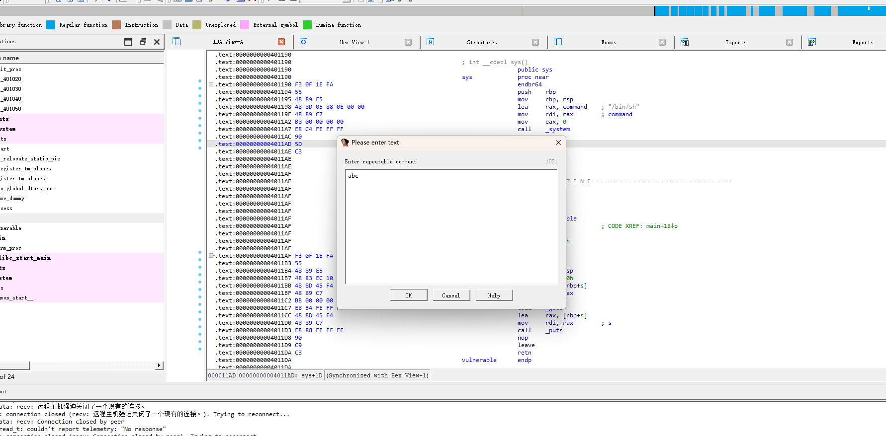

## 开启首行偏移

IDA Options > Disassembly > Line prefixes

## 切换文本界面

space 切换成文本界面

## IDA View

反汇编窗口

## Hex View

文件十六进制 

## Structures

结构体识别视图

## Enums

枚举类型视图

## Imports

导入模块

## Exports

导出模块

## ACEU指令
A 字符串
C 代码
D 数据
U 未定义

## 跳转
G 跳转到哪行

## 搜索

alt + T

## 改函数声明
函数名按 Y

## 改名字
n 

## 创建结构体
insert 创建结构体

ends 按d 新增成员

alt + q 可以指定成自定义的结构体

## 注释
;

shift+ ;  无副本冒号

函数名位置 按;  描述函数注释

## 交叉引用

选函数名
view ->open subviews -> cross references

# 双机调试

1. 本机安装windbgz
2. 虚拟机中修改boot.ini
3. 设置虚拟机
4. 修改windbg运行参数 指向虚拟机

# IDC ?
